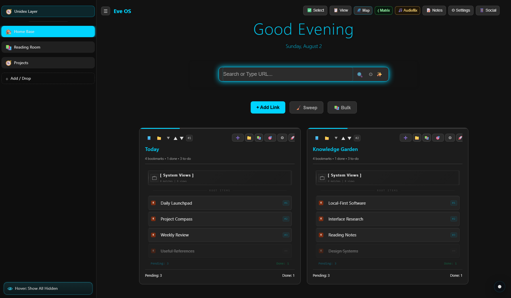
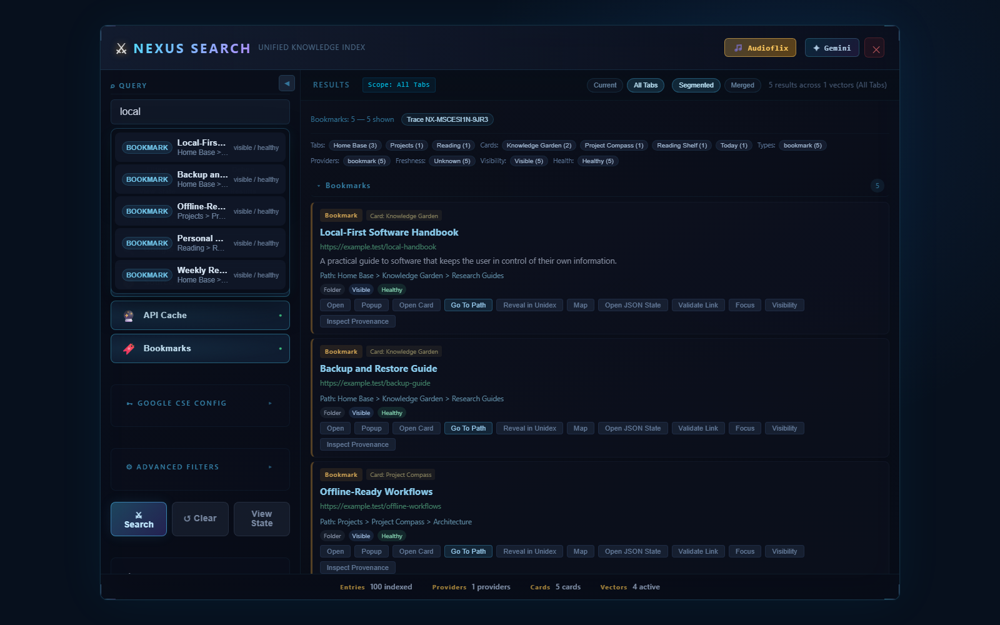
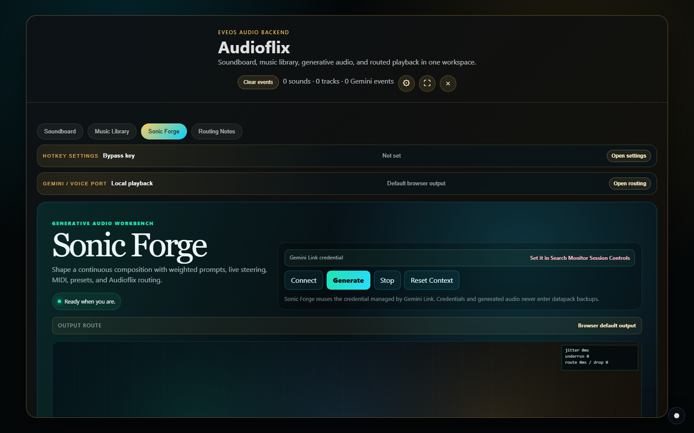

# EveOS

**A local-first workspace for bookmarks, libraries, research, media, and personal knowledge.**

EveOS turns a large collection of links into a browsable environment of tabs, cards,
folders, notes, metadata, maps, search views, and media tools. It is designed around a
simple principle: **the user should remain in control of the information they organize.**

Core workspace data can live in files you control instead of existing only inside a
hosted account. Optional online providers and AI tools are available when wanted, but
they are not the foundation of the archive.

> **Project scale:** around **350,000 lines of first-party code and test automation**
> across more than 2,200 source and test files.



*The main dashboard organizes a datapack into workspaces, cards, folders, and bookmarks.
The screenshot uses synthetic demo content; no personal datapack data is included.*

## Why EveOS Exists

Many useful collections become trapped behind one service, one account, or one sync
provider. If that provider changes its rules, closes an account, removes a feature, or
disappears, the user can lose access to the structure they spent years building.

EveOS takes a different approach:

- **User-controlled storage.** Keep the core archive in browser storage or a modular
  flat-file store on your own machine.
- **Portable datapacks.** Export and restore the workspace instead of treating a cloud
  account as the only copy.
- **Local-first operation.** The dashboard and many core workflows work directly from
  `EveOS.html`; the local server unlocks larger stores and backend-assisted features.
- **Optional integrations.** Gemini, metadata providers, scrapers, Spotify, YouTube,
  and other services are enhancements, not ownership of the archive.
- **Graceful scale.** Deferred rendering, adaptive hydration, worker-backed indexing,
  and focused views keep large collections usable.

Local-first does not mean remote websites can never disappear, and it is not a
replacement for backups. It means the organization, notes, relationships, and metadata
you create are not intentionally locked to one hosted EveOS account.

## What It Can Do

| Area | What it provides |
| --- | --- |
| **Dashboard** | Nested workspaces, cards, folders, bookmarks, shortcuts, pinning, task states, notes, and custom ordering. |
| **Library** | Rich media metadata, aliases, chapters or episodes, statuses, covers, attached sources, and blended ratings. |
| **Nexus Search** | Search across the active tab or the whole datapack, inspect provenance, and jump directly to a result's location. |
| **Constellation Map** | Explore the workspace as a scalable graph with scoped entry from the current tab. |
| **Matrix Workshop** | A visual workspace with datapack-aware phone, cover-atlas, and navigation tools. |
| **Audioflix** | Soundboard, music library, playlist imports, local media paths, routing controls, and Spotify-backed playback. |
| **Sonic Forge** | Shape live generative music with weighted prompts, steering controls, scenes, visualizers, MIDI, and recording tools. |
| **Gemini Link** | Optional live conversation, screen observation, scoped EveOS context relay, and data-stream controls. |
| **Recovery and history** | Datapack exports, modular state, guarded synchronization, and time-oriented inspection tools. |

## Explore The Interface

### Search a large archive without losing its structure



Nexus Search keeps paths, cards, folders, visibility, and provenance attached to each
result. Search scopes can stay local to the current workspace or expand across the
datapack from the Unidex layer.

### Work with audio and generative tools in the same environment



Audioflix combines saved sounds and music with routed playback. Sonic Forge adds a live
generative-audio workbench while reusing credentials managed by Gemini Link.

## Getting Started

### Fastest Windows path

1. Install a current Chromium-based browser and Python 3.10 or 3.11.
2. Run `start-server.bat`.
3. Choose **Start EveOS port only** for a plain local site, or **Start EveOS instance**
   to launch with a selected datapack.
4. Open the address shown by the launcher, such as
   `http://127.0.0.1:8765/EveOS.html`.

The root launcher also exposes the Gemini backend and supporting bridge controls.

### Browser-only path

Open `EveOS.html` directly. This `file://` mode keeps the core workspace available
without starting the local server. Features that need filesystem access, playlist
extraction, native audio routing, modular disk storage, or backend bridges still require
the localhost runtime.

### Fresh development checkout

```powershell
python -m venv .venv
.venv\Scripts\python -m pip install -r requirements.txt
npm ci
start-server.bat
```

Run the repository preflight before broad code changes:

```powershell
npm run verify
```

See the [development guide](docs/DEVELOPMENT.md) for architecture, launcher behavior,
module boundaries, backend services, and the smoke-test protocol.

## Your Data And Privacy

EveOS separates core user data from optional network features:

1. **Core workspace state** contains tabs, cards, folders, bookmarks, notes, settings,
   relationships, and supported Audioflix metadata.
2. **Datapack exports** provide a user-controlled path for moving and restoring that
   state.
3. **Machine-local runtime settings** cover items such as filesystem permissions,
   device routes, and service configuration.
4. **Optional integrations** send only the data required for the feature you choose to
   use, subject to that provider's own terms and privacy policy.

API credentials and browser-granted filesystem permissions should be treated as
machine-local secrets, not portable datapack content. Keep independent copies of
important exports, especially before large imports, merges, or migrations.

## How The Project Is Organized

```text
EveOS.html             Browser entry point
js/modules/            Frontend state, features, UI, and orchestration
css/modules/           Component and feature styling
server/                Local HTTP runtime and Gemini backend
server_modules/        Backend helpers and service boundaries
tools/smoke/           Focused browser and runtime regression coverage
tools/audit/           Repository integrity and safety checks
docs/                  Technical documentation and public screenshots
```

The codebase favors small domain modules, explicit state links, scoped rendering, and
focused regression tests. Large features such as Nexus, Audioflix, Gemini Link, and the
dashboard are split into dedicated module families rather than one monolithic script.

## Project Size

The "around 350,000 lines" figure is a physical line count of first-party JavaScript,
CSS, HTML, Python, PowerShell, and batch files:

- **354,160 physical lines**
- **2,296 first-party source and test files**
- about **287,800 runtime-code lines**
- about **57,600 smoke-test lines**

The count excludes generated datapacks, dependencies, build output, coverage output,
Playwright artifacts, and third-party or vendor bundles. It is a snapshot, not a
permanent badge; the repository will continue to change.

## Project Status

EveOS is an actively evolving personal knowledge system. It has broad automated smoke
coverage, but its feature surface is large and some integrations depend on third-party
APIs, browser capabilities, local services, or Windows audio tooling.

If you are evaluating or modifying it:

- begin with a disposable or backed-up datapack;
- keep credentials out of commits and exports;
- run the nearest focused smoke after a change;
- run `npm run verify` before publishing broad changes.

## License

EveOS is available under the [MIT License](LICENSE).
